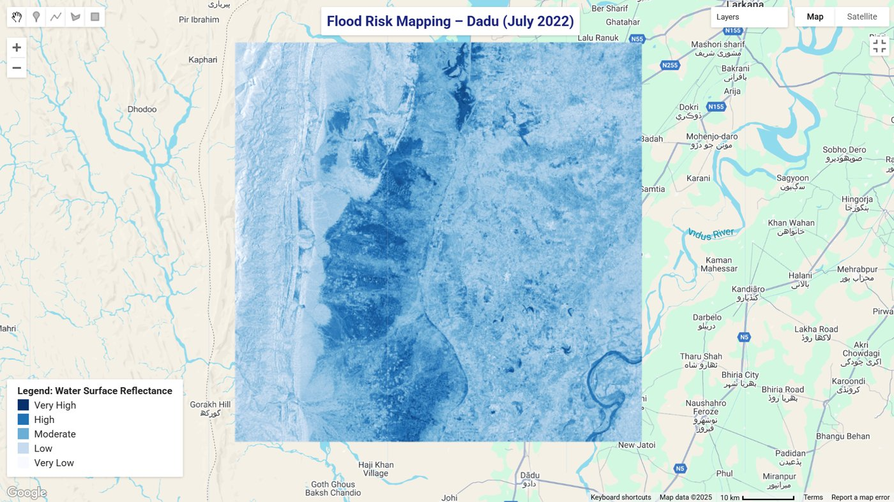
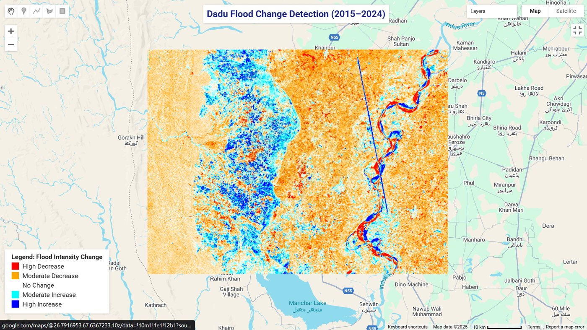
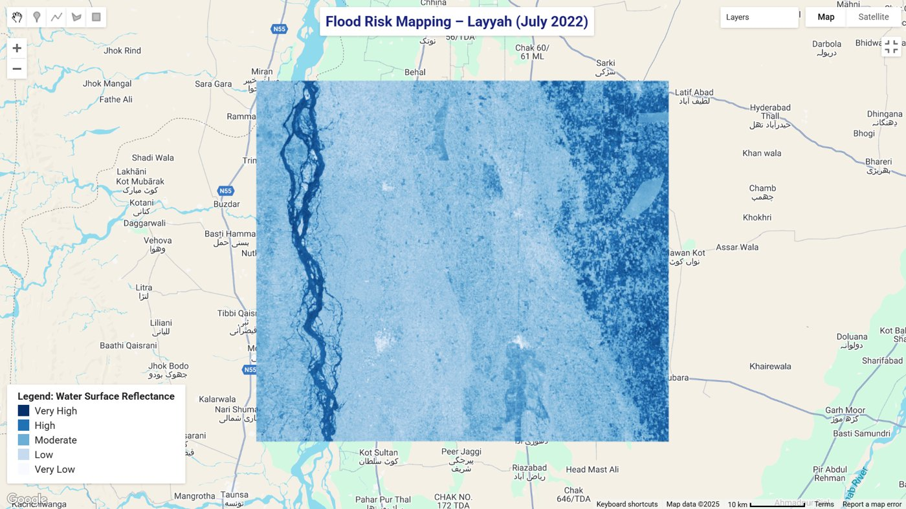
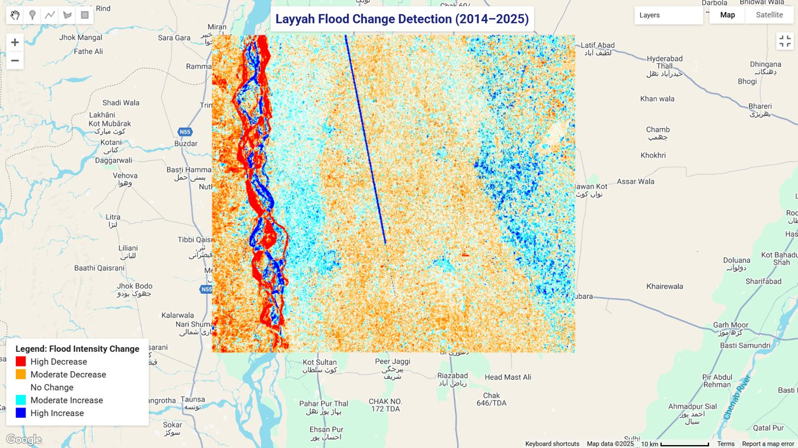
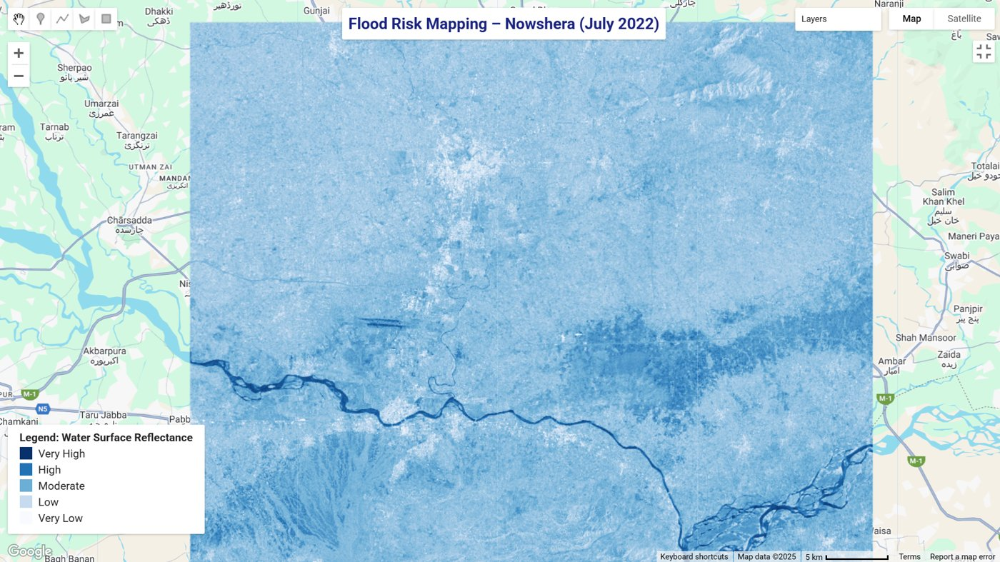
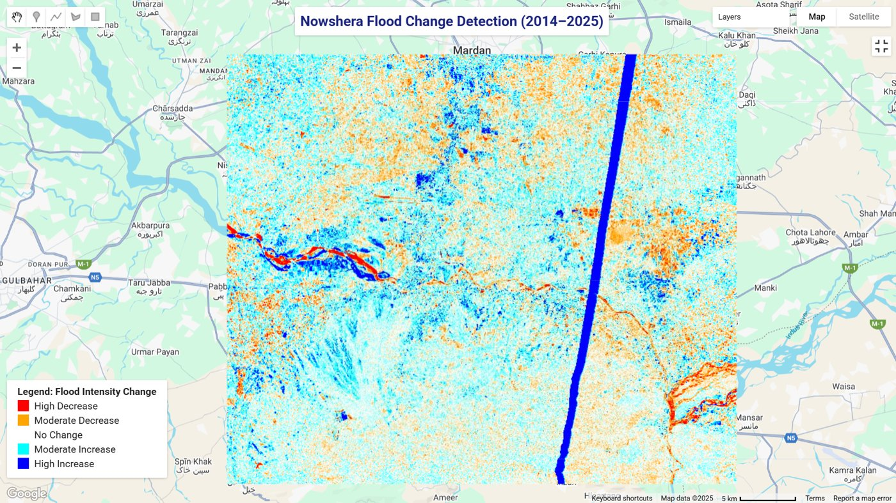

# Flood Risk Mapping in Pakistan Using Remote Sensing & Change Detection

A geospatial analysis of monsoon flood vulnerability across three high-risk districts in Pakistan, combining July 2022 flood extent mapping with 11 years of change detection (2014 to 2025) from Sentinel-1 SAR imagery in Google Earth Engine.



**At a glance:** 3 districts · 2 analyses per district · 11 years of change detection (2014 to 2025) · Sentinel-1 SAR · 6 live Earth Engine scripts

## Problem

Pakistan's monsoon floods repeatedly devastate low-lying districts, and the 2022 super floods showed how little warning and planning many of them had. Optical satellites struggle during monsoon season because of cloud cover. This project uses radar imagery, which sees through clouds, to map where flooding occurred in July 2022 and to show how flood-prone areas have shifted over 11 years, to support disaster management and resilience planning.

## Regions of Study

| Region | Province | Key Vulnerability | Critical Finding |
|---|---|---|---|
| Layyah | Punjab | Indus River overflow, irrigation breaches | Moderate-to-high flood increase in southern zones |
| Dadu | Sindh | Flat terrain, poor drainage, 2022 super floods | Most critical zone, persistent inundation since 2022 |
| Nowshera | KPK | Kabul & Swat rivers, urban expansion | Expanding floodplain with lateral spread over 11 years |

## Key Findings

| Region | July 2022 Flood Risk Mapping | Change Detection (2014 to 2025) |
|---|---|---|
| **Layyah** | Moderate-to-high SAR reflectance along the Indus belt, indicating riverine flooding | Moderate surface water increase, driven by intensified monsoon cycles and irrigation failures |
| **Dadu** | Deep inundation across a wide floodplain, aligning with reports of 70%+ land submersion at peak | Significant increase in persistent flood zones, with poor post-flood drainage rehabilitation evident |
| **Nowshera** | High reflectance along the Kabul River floodplain, extending into urban and peri-urban zones | Visible lateral spread of floodplain activity, reflecting higher upstream rainfall frequency |

## Analysis Overview

| Analysis | Function |
|---|---|
| Flood Risk Mapping (July 2022) | Maps flood extent from Sentinel-1 SAR imagery during the 2022 monsoon peak |
| Flood Change Detection (2014 to 2025) | Shows how flood-affected areas expanded or persisted over 11 years |
| Regional Comparison | Applies the same method to three districts in three provinces with different flood drivers |

## Key Design Decisions

**Radar, not optical imagery.** Sentinel-1 SAR penetrates cloud cover, which is what makes flood mapping possible during monsoon season when optical satellites are blocked.

**Same method across all three districts.** Each region uses the same Sentinel-1 filters (IW mode, VV polarization), so differences between districts reflect real conditions on the ground and not differences in processing.

**Short-term event plus long-term trend.** The July 2022 maps show what one extreme event looked like, while the 2014 to 2025 change detection shows whether that vulnerability is growing. Together they separate a one-off disaster from a worsening pattern.

**Live, reproducible code.** Every map has a public Earth Engine script, so anyone can rerun, inspect, or adapt the analysis.

## Results

### Dadu (Sindh)

The most critical zone. The July 2022 map is shown at the top of this README. The change map shows persistent flood zones increasing since 2022.



### Layyah (Punjab)

Flooding concentrated along the Indus belt in July 2022, with a moderate increase in surface water over 11 years.





### Nowshera (KPK)

High reflectance along the Kabul River floodplain in July 2022, with the floodplain spreading laterally over time.





## Live GEE Code

| Region | Flood Risk Mapping (July 2022) | Change Detection (2014 to 2025) |
|---|---|---|
| Nowshera | [Open script](https://code.earthengine.google.com/5ed4681223e5f6ebddd9a04918f7a0f6) | [Open script](https://code.earthengine.google.com/047eaeae1e3c94ca2bb3cf406fd29c72) |
| Dadu | [Open script](https://code.earthengine.google.com/eab40dd4883a577579e3a8966b18bd72) | [Open script](https://code.earthengine.google.com/4e9ad907dad2bd1eeec365396ccebcdc) |
| Layyah | [Open script](https://code.earthengine.google.com/f4e357b713cf5be1e00a247facaca36e) | [Open script](https://code.earthengine.google.com/96ed8c59afcb21ec9f39561673fc3234) |

## Sample GEE Code

```javascript
// Define region of interest
var nowshera = ee.Geometry.Rectangle([71.800, 33.900, 72.400, 34.300]);
Map.centerObject(nowshera, 9);

// Load Sentinel-1 SAR imagery (July 2022)
var nowsheraImage = ee.ImageCollection('COPERNICUS/S1_GRD')
  .filterBounds(nowshera)
  .filterDate('2022-07-01', '2022-07-31')
  .filter(ee.Filter.listContains('transmitterReceiverPolarisation', 'VV'))
  .filter(ee.Filter.eq('instrumentMode', 'IW'))
  .select('VV')
  .mean()
  .clip(nowshera);
```

## Tools & Technology

| Tool | Purpose |
|---|---|
| Google Earth Engine | Satellite image processing and flood analysis |
| Sentinel-1 SAR | Radar-based imagery, penetrates cloud cover |
| geopandas | Geospatial data handling |
| rasterio | Raster image processing |
| matplotlib | Post-processing visualizations |

## Outputs

| File | Description |
|---|---|
| Flood Risk Mapping Imagery.pdf | SAR maps for all 3 regions, July 2022 |
| Flood Change Detection Imagery.pdf | 11-year change maps for all 3 regions (2014 to 2025) |
| Geospatial Flood Risk Assessment (Sentinel-1 SAR Analysis).pdf | Full report with methodology, findings, and citations |

## Applications

- **Disaster Management**: early response and relief coordination
- **Policy Making**: region-specific flood preparedness strategies
- **Agriculture**: crop insurance and water management planning
- **Urban Planning**: identifying high-risk settlement zones

## How to Use

1. Sign in to [Google Earth Engine](https://code.earthengine.google.com/) with an approved account.
2. Open any script from the Live GEE Code table above.
3. Click **Run** to generate the map for that region and period.
4. Read the full report PDF for methodology, findings, and citations.

## Project Structure

```
├── Geospatial Flood Risk Assessment (Sentinel-1 SAR Analysis).pdf   # Full report
├── images/                                                          # Maps used in this README
│   ├── risk-dadu-jul2022.jpg
│   ├── risk-layyah-jul2022.jpg
│   ├── risk-nowshera-jul2022.jpg
│   ├── change-dadu.jpg
│   ├── change-layyah.jpg
│   └── change-nowshera.jpg
└── README.md
```
